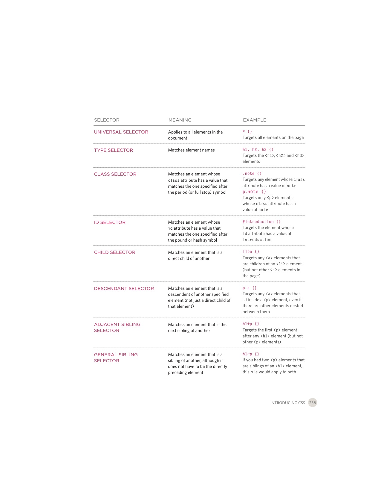

# Notes on CSS

## from _HTML & CSS_ by Jon Duckkett

I. Chapter 10: Introducing CSS

    A. What CSS Does: "CSS allows you to create rules that specify how the content of an element should appear."

    B. How CSS Works

        i. "The key to understanding how CSS works is to imagine that there is an invisible box around every HTML element."
        ii. "CSS allows you to create rules that control the way that each individual box (and the contents of that box) is presented."

    C. Rules, Properties, and Values

        i. "A CSS rule contains two parts: a selector and a declaration."
        ii. Ex: p is the selector and font-family: Arial is the declaration.
        iii. "CSS declarations sit inside curly brackets and each is made up of two parts: a property and a value, separated by a colon."

    D. Linking CSS to HTML

        i. Internally: style tag nested in the head tag: outdated method. 
        ii. Externally: link tag nested in the head and utilizing the href, type, and rel attributes. 
            a. href: "This specifies the path to the CSS file (which is often placed in a folder called css or styles)."
            b. type: "This attribute specifies the type of document being linked to. The value should be text/css."
            c. "rel: This specifies the relationship between the HTML page and the file it is linked to. The value should be stylesheet when linking to a CSS file."
        iii. Example
        ---
        <link href="css/styles.css" type="text/css" rel="stylesheet" />
        ---
        iv. Benefits of external over internal linking
            a. "Allows all pages to use the same style rules (rather than repeating them in each page)."
            b. "Keeps the content separate from how the page looks."
            c. "Means you can change the styles used across all pages by altering just one file (rather than each individual page)."
        
    E. CSS Selectors
        i. Case sensitive.
        ii. General types of selectors

        

<a href="README.md"><button type="button">Home</button></a>