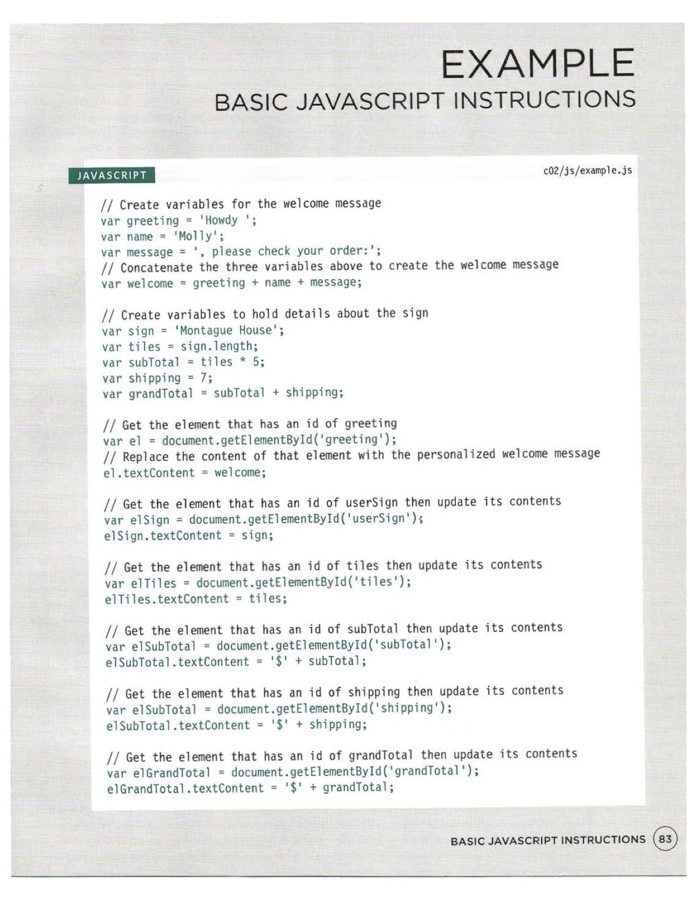

# Class 02 Reading Notes

## _HTML & CSS_ by Jon Duckett

I. Chapter 2: Text (pp. 40 - 61)

    A. Two typies of markup:
        1. Structural: "the elements that you can use to describe both headings and paragraphs."
        2. Semantic: "which provides extra information; such as where emphasis is placed in a sentence, that something you have written is a quotation (and who said it), the meaning of acronyms, and so on."
    B. Main tags
        1. headings: six levels, <h1> through <h6>, with h1 being reserved for the main heading and the rest for subheadings, meant to be used hierarchically. 
        2. 
: "By default, a browser will show each paragraph on a new line with some space between it and any subsequent paragraphs."
        3. : "The  element is used to contain characters that should be superscript such as the suffixes of dates or mathematical concepts like raising a number to a power such as 22."
        4. : "The  element is used to contain characters that should be subscript. It is commonly used with foot notes or chemical formulas such as H20."
    C. Line breaks and horizontal rules (these are empty elements)
        1.  : "the browser will automatically show each new paragraph or heading on a new line. But if you wanted to add a line break inside the middle of a paragraph you can use the line break tag."
        2. 
: horizonatal rule.
    D. Semantic markup: "text elements that are not intended to affect the structure of your web pages, but they do add extra information to the pages"
        1. <strong>: bold (by default)
        2. <em>: italics (by default)
        3. <blockquote>: "The <blockquote> element is used for longer quotes that take up an entire paragraph. Note how the 
 element is still used inside the <blockquote> element." Don't use this element to introduce indentation; use CSS for that. 
        4. <q>: IE doesn't recognize it, so it's mostly avoided--is that the case now??--but it puts quotes around text. Both this and the blockquote may have a cite element with a URL assigned to it.
        5. <abbr>: "If you use an abbreviation or an acronym, then the <abbr> element can be used. A title attribute on the opening tag is used to specify the full term."
        6. <cite>: "When you are referencing a piece of work such as a book, film or research paper, the <cite> element can be used to indicate where the citation is from."
        7. <dfn>: "The first time you explain some new terminology (perhaps an academic concept or some jargon) in a document, it is known as the defining instance of it."
        8. <address>: "contain contact details for the author of the page. It can contain a physical address, but it does not have to. For example, it may also contain a phone number or email address."
        viii. <ins> and <del>: "The <ins> element can be used to show content that has been inserted into a document, while the <del> element can show text that has been deleted from it." ins underlines the entry, while del strikes it out.
        9. <s>: strikethrough. 

II. Chapter 10: Introducing CSS (pp. 226 - 245)

    A. What CSS Does: "CSS allows you to create rules that specify how the content of an element should appear."
    B. How CSS Works
        1. "The key to understanding how CSS works is to imagine that there is an invisible box around every HTML element."
        2. "CSS allows you to create rules that control the way that each individual box (and the contents of that box) is presented."
    C. Rules, Properties, and Values
        1. "A CSS rule contains two parts: a selector and a declaration."
        2. Ex: p is the selector and font-family: Arial is the declaration.
        3. "CSS declarations sit inside curly brackets and each is made up of two parts: a property and a value, separated by a colon."

    D. Linking CSS to HTML
        1. Internally: style tag nested in the head tag: outdated method. 
        2. Externally: link tag nested in the head and utilizing the href, type, and rel attributes. 
            a. href: "This specifies the path to the CSS file (which is often placed in a folder called css or styles)."
            b. type: "This attribute specifies the type of document being linked to. The value should be text/css."
            c. "rel: This specifies the relationship between the HTML page and the file it is linked to. The value should be stylesheet when linking to a CSS file."
        3. Example
        ---
        <link href="css/styles.css" type="text/css" rel="stylesheet" />
        ---
        4. Benefits of external over internal linking
            a. "Allows all pages to use the same style rules (rather than repeating them in each page)."
            b. "Keeps the content separate from how the page looks."
            c. "Means you can change the styles used across all pages by altering just one file (rather than each individual page)."
        
    E. CSS Selectors
        1. Case sensitive.
        2. General types of selectors

    

    F. "How CSS Rules Cascade"
        A. Last Rule: "If the two selectors are identical, the latter of the two will take precedence."
        2. Specificity: "If one selector is more specific than the others, the more specific rule will take precedence."
        3. Important: "You can add !important after any property value to indicate that it should be considered more important than other rules that apply to the same element."
        4. Inheritance: Font-family and color elelments will apply to child elements, while elements like background-color or borders are not inherited. 
        5. "You can force a lot of properties to inherit values from their parent elements by using inherit for the value of the properties."

---

## _JavaScript & jQuery_ by Jon Duckett

I. Chapter 2: Basic JavaScript Instructions (pages 53 - 84)

    A. Statements
        1. The individual steps of a script; they alwyas end in a semi-colon.
        2. Each statement should start on a new line.
        3. The ";" tells the interpreter to move to the next step. 
        4. Statements may be grouped together in code blocks, surrounded by curly braces {}.
    B. Comments
        1. Comments help make code easier to read.
        2. It's a good practice using comments to indicate what your code does. 
        3. // Single-line comments are indicated by two forward slashes before the text
        4. /* Multi-line comments should be marked off thusly */
    C. Variables
        1. Scripts use variables as temporary containers of information.
        2. Variables do not store information across browser sessions.
        3. To declare a variable: `var quantity` is the keyword and name. Use "camelCase" if the variable is more than one word. 
        4. "Where possible, a variable's name should describe the kind of data [it] holds." 
        5. A variable is undefinded until a value is assigned to it, e.g., quantiy = 3. 
        6. Six rules for naming a variable:
            a. begins with a letter, dollar sign, or underscore, but _not_ with a number;
            b. contains letters, numbers, dollar sign, and/or underscore, but may not contain a hyphen or a period;
            c. cannot contain keywords, e.g., var, or reserved words, i.e., those reserved for potential future use in JS;
            d. are case sensitive;
            e. uses a name that describes the information stored in it; 
            f. uses camel case. 
    D. Data types include numbers (e.g., 45), strings ('words' or symbols, e.g., '45'), and booleans (true or false). 
    E. Arrays: a special type of variable that stores a list or set of related values, not just one value, e.g., a shopping list. 
        1. Arrays are declared the same way, using var + name
        2. They are defined using brackets and commas, e.g., colors = ['white', 'black', 'custom']; (this syntax is called an "array literal.") There is an alternative syntax called an "array constructor," which has the var + name set equal to: newArray =                      
                                    ('white',
                                        'black',
                                        'custom');
        iii. They may include any type of data type simultaneously. 
        iv. "Values in an array are accessed as if they are [sic] in a number list. . . . [T]he numbering of this list starts at zero (not one)." 

    F. Expressions + Operators
        1. Expresions: "an expression results in a single value"
            a. two types of expressions
                i. assigns a value to a variable: var color = 'beige';
            ii. uses two-plus values to return a single value: var area = 3 * 2;

    G. Operators: "allows programmers to create a single value from one or more values"
        1. Some types of operators
            a. Assignment: color = 
            b. Arithmetic: area = 
            c. String (combines two strings): greeting = "Hi" + "Molly";
            d. Comparison (returns true or false): buy = 3 > 5; (false)
            e. Logical (combine expressions): Buy = (5>3) && (2 < 4); (true)
        2. Arithmetic operators
            a. addition +
            b. substraction -
            c. Division /
            d. Multiplication *
            e. Increment ++ : Adds one to the current number
            f. decrement -- : Subtracts one from the current number
            g. Modulus % : divides two values and returns the remainder
        3. Order of execution
            a. Multiplication and division, then;
            b. Addition and subtraction. 
            c. To change the priority, use parentheses around the first calculation. 
        4. String operator is + and is used to join two strings.

    H. 

II. Chapter 4: Decisions and Loops (pp. 145 - 162)

    A. Contolling flow (determining which code to run)
        1. Evaluations: analyze values in scripts to determine whether they match expected results.
        2. Decisions: choose a path to take based on the results of evaluations.
        3. Loops: repeat a set of steps. 
    B. Decision-making: 
        1. flowcharts help to plan for forks in the road.
        2. Two components of a decision
            a. "An expression is evaluated, which returns a value," based on which,
            b. "A conditional statement says what to do in a given situation." 
    C. Comparison operators: evaluating conditions, typically return values of true and false
        1. Compare one value with what is expected using a comparison operator and a boolean, 
        2. Some types of comparison operators
            a. == (is equal to) 
            b. != (is not equal to)
            c. === (is strictly equal to, including data type)
            d. !== (is strictly unequal, including data type)
            e. > (greater than)
            f. < (less than)
            g. >= (greater than or equal to)
            h. <= (less than or equal to)
    D. Logical operators: "allow you to compare the results of more than one comparison operator"
        1. Types
            a. && (logical and): tests more than one condition, e.g., `((2 < 5) && (3 >=2))`
            b. || (logical or): tests at least one condition, e.g., `((2 < 5) || (2 < 1))`
            c. ! (logical not): inverts a single boolean value, e.g., `!(2 < 1) returns true.
        2. "Logical expressions are evaluated left to right."
    E. If and if...else statements
        1. "The if statement evaluates . . . a condition. If the condition evaluates to true, any statements in the subsequent code block are executed."
        2. "The if...else statement checks a condition. If it resolves to true, the first code block is executed. If the condition resolves to false the second code block is run instead."

[<--back](201week1.md)

[<--home-->](../../README.md)
