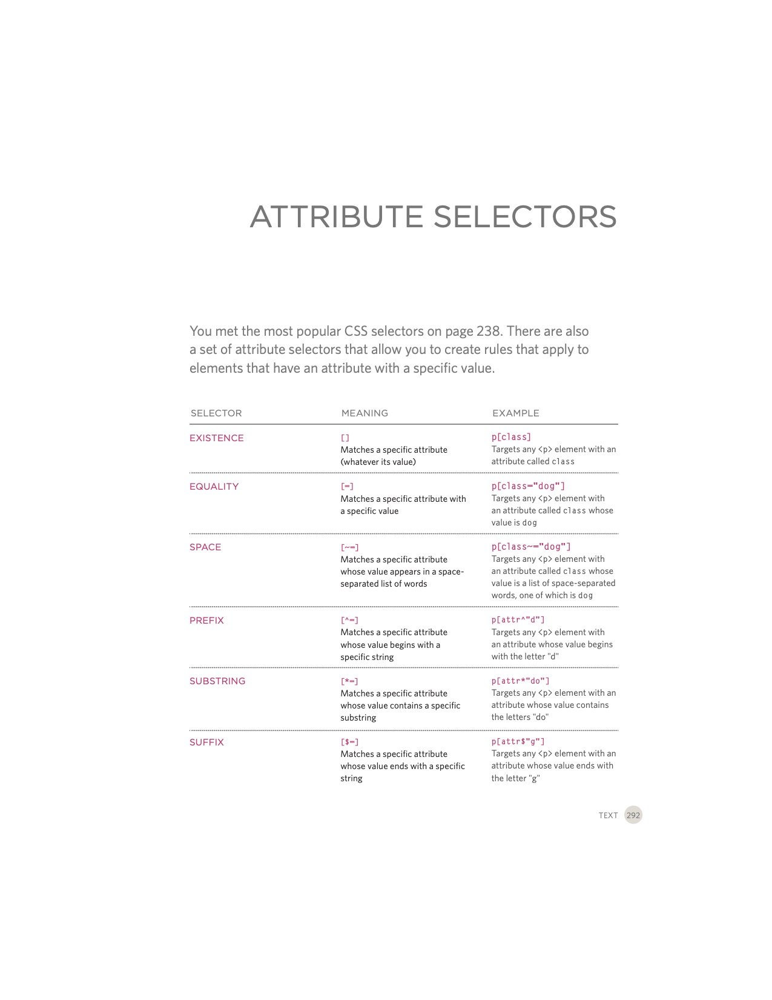

# Code 201 | Class05 | Reading Notes | 2 October 2020

## _HTML & CSS_ by Jon Duckett

### Chapter 5: Images (pp. 94 - 125)

I. Include an image in your web pages using HTML (you can also use CSS to include images in your pages using the background-image property, which you will meet on pages 413-420.)

    A. Choosing images
        1. "Images can be used to set the tone for a site in less time than it takes to read a description."
        2. "There are companies who sell stock images; these are images you."
        3. "Remember that all images are subject to copyright."
        4. "Putting [images]] on a simple, consistent background helps them look better as a group."
    B. Images should do the following: 
        1. be relevant;
        2. convey information; 
        3. convey the right mood;
        4. be instantly recognisable;
        5. fit the color palette.
    C. Storing images: Separate folder and subfolders, depending on the size of the site and number of images.
    D. Adding images
        1. ``: an empty element, i.e., self-closing; requires two attributes.
            a. src: "This tells the browser where it can find the image file."
            b. alt: "This provides a text description of the image which describes the image if you cannot see it."
                i. "It should give an accurate description of the image content so it can be understood by screen reader software (used by people with visual impairments) and search engines."
                ii. "If the image is just to make a page look more attractive (and it has no meaning, such as a graphic dividing line), then the alt attribute should still be used but the quotes should be left empty."
            c. Optional: title: "You can also use the title attribute with the  element to provide additional information about the image. Most browsers will display the content of this attribute in a tootip when the user hovers over the image."
        2. Height and width attributes: `` attritubtes: 
            i. "Images often take longer to load than the HTML code that makes up the rest of the page. It is, therefore, a good idea to specify the size of the image so that the browser can render the rest of the text on the page while leaving the right amount of space for the image that is still loading."
            ii. "The size of images is increasingly being specified using CSS rather than HTML." [According to Lena at CF, CSS should do ALL of the formatting.]
    E. Creating images
        1. Save images in the right format: "Websites mainly use images in jpeg, gif, or png format."
        2. Save images at the right size: "You should save the image at the same width and height it will appear on the website." [How is "right" defined in a world of differing screen sizes?]
        3. Use the correct resolution: not bigger than most screens [in pixels per inch; per Duckett--and who knows when this segement was updated since this book came out in 2000--most computer screens show webpages at 72 pixels per inch.].   

II. Pick which image format to use

    A. JPEG: "Whenever you have many different colors in a picture";
    B. GIF or PNG: "when saving images with few colors or large areas of the same color."

III. Show an image at the right size

    A. Width and height: "The images you use on your website should be saved at the same width and height that you want them to appear on the page."
    B. E.g., "if you have designed a page to include an image that is 300 pixels wide by 150 pixels tall, the image you use should be 300 x 150 pixels."

IV. Optimize an image for use on the web to make pages load faster

    A. Image resolution: "Images created for the web should be saved at a resolution of 72 ppi. The higher the resolution of the image, the larger the size of the file."
    B. By contrast, "Images in print materials are . . . usually printed at a resolution of 300 dots per inch (dpi)."
    C. "Due to the fact that computer displays are capped at a resolution of 72 ppi, using images on the web with a higher resolution will not result in better image quality — only in larger file sizes, which will increase the time needed to load them and therefore slow down viewing of your web pages."
    D. Vector images
        1. "Vector images differ from bitmap images and are resolution-independent."
        2. "When an image is a line drawing (such as a logo, illustration, or diagram), designers will often create it in vector format."
        3. "ector images are created by placing points on a grid, and drawing lines between those points. A color can then be added to "fill in" the lines that have been created."
        4. "The advantage of creating line drawings in vector format is that you can increase the dimensions of the image without affecting the quality of it."
    E. Animated GIFs
        1. "Animated GIFs show several frames of an image in sequence and therefore can be used to create simple animations."
        2. "Each extra frame of the image increases the size of the file, and can therefore add to the time it takes for an image to download (and web users do not like waiting a long time for images to download)." [Is this even really an issue, at least in places with high-speed internet?]
    F. Transparency: "Creating an image that is partially transparent (or "see-through") for the web involves selecting one of two formats:"
        1. "If the transparent part of the image has straight edges and it is 100% transparent (that is, not semi-opaque), you can save the image as a *GIF* (with the transparency option selected)."
        2. "If the transparent part of the image has diagonal or rounded edges or if you want a semi- opaque transparency or a drop- shadow, then you will need to save it as a PNG."
V. HTML5
    A. `<figure>`: "HTML5 has introduced a new `<figure>` element to contain images and their caption so that the two are associated."
    b. `<figcaption>`: "The `<figcaption>` element has been added to HTML5 in order to allow web page authors to add a caption to an image. Before these elements were created there was no way to associate an `` element with its caption."

### Chapter 11: Color (pp. 246 - 263)

I.  Specifying color

    A. Foreground
        1. color property: "allows you to specify the color of text inside an element."
        2. background-color property
            a. "CSS treats each HTML element as if it appears in a box, and the background-color property sets the color of the background for that box."
            b. "If you do not specify a background color, then the background is transparent."
            c. "By default, most browser windows have a white background, but browser users can set a background color for their windows, so if you want to be sure that the background is white you can use the background-color property on the `<body>` element."

II. Color terminology

    A. "Every color on a computer screen is created by mixing amounts of red, green, and blue."
    B. "Computer monitors are made up of thousands of tiny squares called pixels (if you look very closely at your monitor you should be able to see them)."
    C. Thee ways to define colors:
        1. RGB values: "Values for red, green, and blue are expressed as numbers between 0 and 255", e.g., rgb(102,205,170); 
        2. Hex codes: "Hex values represent values for red, green, and blue in hexadecimal code" [base 16: 0-9 and a-g], e.g., #66cdaa;
        3. Color names: "Colors are represented by predefined names. However, they are very limited in number", e.g., MediumAquaMarine. 
        4. HSL colors: "CSS3 introduces an entirely new and intuitive way to specify colors using hue, saturation, and lightness values."
            a. hue: "Hue is the colloquial idea of color. In HSL colors, hue is often represented as a color circle where the angle represents the color, although it may also be shown as a slider with values from 0 to 360."
            b. saturation: "Saturation is the amount of gray in a color. Saturation is represented as a percentage. 100% is full saturation and 0% is a shade of gray."
            c. lightness: "Lightness is the amount of white (lightness) or black (darkness) in a color. Lightness is represented as a percentage. 0% lightness is black, 100% lightness is white, and 50% lightness is normal. Lightness is sometimes referred to as luminosity."
            d. Using it: hsl and hsla
                i. "The value of the property starts with the letters hsl, followed by individual values inside parentheses for": hue, saturation, and lightness.
                ii. HSLa = hsl + a = "a fourth value which represents transparency (just like the rgba property). The a stands for: alpha", also expressed as a number between 0 and 1. 
    D. Elements of color
        1. Hue: "Hue is near to the colloquial idea of color."
        2. Saturation: "saturation refers to the amount of gray in a color. At maximum saturation, there would be no gray in the color. At minimum saturation, the color would be mostly gray."
        3. Brightness: "Brightness (or "value") refers to how much black is in a color. At maximum brightness, there would be no black in the color. At minimum brightness, the color would be very dark."
        4. Opacity: 
            a. "CSS3 introduces the opacity property which allows you to specify the opacity of an element and any of its child elements. The value is a number between 0.0 and 1.0 (so a value of 0.5 is 50% opacity and 0.15 is 15% opacity)."
            b. "The CSS3 rgba property allows you to specify a color, just like you would with an RGB value, but adds a fourth value to indicate opacity. This value is known as an alpha value and is a number between 0.0 and 1.0."
            c. "Because some browsers will not recognize RGBA colors, you can offer a fallback so that they display a solid color. If there are two rules that apply to the same element, the latter of the two will take priority."

III. Contrast; readable text: "When picking foreground and background colors, it is important to ensure that there is enough contrast for the text to be legible."

    A. Low contrast: "Text is harder to read when there is low contrast between background and foreground colors. A lack of contrast is particularly a problem for those with visual impairments and color blindness. It also affects those with poor monitors and sunlight on their screens (which is increasingly common as people use handheld devices outdoors)."
    B. High: "Text is easier to read when there is higher contrast between background and foreground colors", though it's important too avoid too much contrast.
    C. Medium: "For long spans of text, reducing the contrast a little bit improves readability. You can reduce contrast by using dark gray text on a white background or an off-white text on a dark background."

### Chapter 12: Text (pp. 264 - 299)

I. Typeface terminology
    
    A. serif: "Serif fonts have extra details on the ends of the main strokes of the letters. These details are known as serifs. . . . In print, serif fonts were traditionally used for long passages of text because they were considered easier to read."
    B. sans-serif: "Sans-serif fonts have straight ends to letters, and therefore have a much cleaner design." [It's funny to me how the author cites preference in the definition of serif fonts but elides that reference when touting the cleanness of sans-serif fonts, when, of course, both positions are matters of opinion and taste.]
    C. Monospace: "Every letter in a monospace (or fixed-width) font is the same width. (Non-monospace fonts have different widths.) Monospace fonts are commonly used for code because they align nicely, making the text easier to follow."
II. Choosing a typeface
    
    A. "When choosing a typeface, it is important to understand that a browser will usually only display it if it's installed on that user's computer."
    B. "sites often use a small set of typefaces that are installed on most computers (shown above). There are some techniques to get around this limitation (which are covered on pages 271-272)."
        a. "Browsers are supposed to support at least one typeface from each of the [following] groups": monospace, cursive, fantasy.
        b. To ensure that something close to your desired font is displayed, "it is common to add the generic font name after your preferred choice of typefaces", e.g., "font-family: Georgia, Times, serif;"
    C. "It is possible to specify more than one typeface and create an order of preference (in case the user does not have your first choice of typeface installed). This is sometimes referred to as a font stack."
III. Text displayed
    
    A. PC < Mac: "If you design on a Mac, it is important to check what the typefaces look like on a PC because PCs can render type less smoothly. But if you design on a PC, then it should look fine on a Mac."
    B. Ways around display discrepancies:
        1. Images: "You can create a graphic that contains the text as you want it to appear in a different typeface."
        2. sIFR: "The font is embedded into a Flash movie, and JavaScript replaces specified HTML text with a flash version of it."
        3. Cufon: "Cufon offers similar functionality to sIFR. It uses JavaScript to create either an SVG or VML version of the text."
    C. Specifying typefaces
        1. font-family
            a. "The font-family property allows you to specify the typeface that should be used for any text inside the element(s) to which a CSS rule applies. . . . You can specify a list of fonts separated by commas so that, if the user does not have your first choice of typeface installed, the browser can try to use an alternative font from the list."
            b. "If a font name is made up of more than one word, it should be put in double quotes."
            c. "Designers suggest pages usually look better if they use no more than three typefaces on a page."
        2. font-size
            a. "The font-size property enables you to specify a size for the font. There are several ways to specify the size of a font. The most common are:"
                i. Pixels
                ii. Percentages
                iii. ems
            b. "Setting font size in pixels is the best way to ensure that the type appears at the size you intended (because percentages and ems are more likely to vary if a user has changed the default size of text in their browser)."
        3. @font-face
            a. "[A]llows you to use a font, even if it is not installed on the computer of the person browsing, by allowing you to specify a path to a copy of the font, which will be downloaded if it is not on the user's machine."
            b. "Because this technique allows a version of the font to be  downloaded to the user's computer, it is important that the license for the font permits it to be used in this way."
            c. font-family: indicates the name of the font
            d. src: path to the font
            e. format: indicates in which format the font is to be supplied in.
IV. Font formats

    A. "Different browsers support different formats for fonts (in the same way that they support different audio and video formats), so you will need to supply the font in several variations to reach all browsers."
    B. [All the other info here seems out of date. Maybe I'm being impetuous. But its referencing iOS 4.2 . . . and Chrome 6+ . . . my Chrome is at version 85. etc.]
    C. font-weight: bold text.
        1. normal: normal weight
        2. bold: bold
    D. font-style: italic
        1. normal: normal
        2. italic: italic
        3. oblique: angles the normal version.
        4. ("It is not unusual for the browser to fail to find an italic version of a typeface, in which case it will use an algorithm to place the normal version of the type on a slant, which means that a lot of italic text online is actually oblique.")
    E. text-transform
        1. uppercase: uppercase
        2. lowercase: lowercase
        3. capitalize: initial capitalization
    F. text-decoration
        1. none: removes decoration already applied
        2. underline: underline
        3. overline: adds a line over the top of text
        4. line-through: strikethrough
        5. blink: animates the text to make it flash
    G. line-height
        1. "Leading (pronounced ledding) is a term typographers use for the vertical space between lines of text."
        2. "Leading is measured from the bottom of the descender on one line to the top of the ascender on the next."
        3. "Increasing the line-height makes the vertical gap between lines of text larger."
    H. letter-spacing; word-spacing
        1. "Kerning is the term typographers use for the space between each letter. You can control the space between each letter with the letter-spacing property."
        2. "You can also control the gap between words using the word-spacing property."
        3. "When you specify a value for these properties, it should be given in ems, and it will be added on top of the default value specified by the font."
    I. text-align
        1. left: text should be aligned to the left.
        2. right: text should be aligned to the right.
        3. center: text is aligned in the middle.
        4. justify: "This indicates that every line in a paragraph, except the last line, should be set to take up the full width of the containing box."
    J. vertical-align
        1. "It is not intended to allow you to vertically align text in the middle of block level elements such as `
` and `
`, although it does have this effect when used with table cells (the `<td>` and `<th>` elements)."
        2. "It is more commonly used with inline elements such as ``, `<em>`, or `<strong>` elements."
        3. Its values are:
            a. baseline
            b. sub
            c. super
            d. top
            e. text-top
            f. middle
            g. bottom
            h. text-bottom
        4. "It can also take a length (usually specified in pixels or ems) or a percentage of the line height."
    K. text-indent
        1. "The text-indent property allows you to indent the first line of text within an element."
        2. "[U]sually given in pixels or ems."
        3. "It can take a negative value, which means it can be used to push text off the browser window."
    L. text-shadow
        1. "It is used to create a drop shadow, which is a dark version of the word just behind it and slightly offset."
        2. "The value of this property is quite complicated because it can take three lengths and a color for the drop shadow."
            a. "The first length indicates how far to the left or right the shadow should fall."
            b. "The second value indicates the distance to the top or bottom that the shadow should fall."
            c. "The third value is optional and specifies the amount of blur that should be applied to the drop shadow."
            d. "The fourth value is the color of the drop shadow." [The book is again giving its age away, as well as how willy nilly it has been updated: "The text-shadow property has become very popular but at the time of writing it was not supported in any versions of Internet Explorer (currently IE9)", which means that this particular update was made in 2011.]
    M. :first-letter; :first-line (technically "pseudo-elements, not properties)
        1. "You specify the pseudo-element at the end of the selector:
        2. Ex: p.intro:first-letter {} etc.
    N. :link; :visited
        1. "Browsers tend to show links in blue with an underline by default, and they will change the color of links that have been visited to help users know which pages they have been to."
        2. "In CSS, there are two pseudo- classes that allow you to set different styles for links that have and have not yet been visited."
            a. :link: "This allows you to set styles for links that have not yet been visited."
            b. :visited: "This allows you to set styles for links that have been clicked on."
        3. "They are commonly used to control colors of the links and also whether they are to appear underlined or not."
    O. :hover; :active; :focus = "There are three pseudo-classes that allow you to change the appearance of elements when a user is interacting with them."
        1. :hover = "This is applied when a user hovers over an element with a pointing device such as a mouse. This has commonly been used to change the appearance of links and buttons when a user places their cursor over them."
        2. :active = "This is applied when an element is being activated by a user; for example, when a button is being pressed or a link being clicked. Sometimes this is used to make a button or link feel more like it is being pressed by changing the style or position of the element slightly."
        3. :focus = "his is applied when an element has focus. Any element that you can interact with, such as a link you can click on or any form control can have focus. Focus occurs when a browser discovers that you are ready to interact with an element on the page. For example, when your cursor is in a form input ready to accept typing, that element is said to have focus. It is also possible to use the tab key on your keyboard to move through the interactive items on a page. When pseudo-classes are used, they should appear in this order: :link, :visited, :hover, :focus, :active."
    P. 

[<--back](201week1.md)

[<--home-->](../../README.md)
