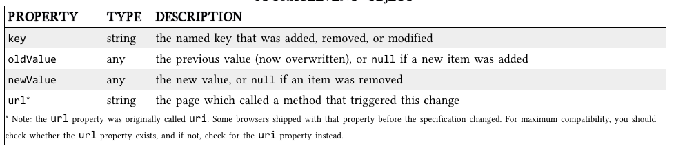

# Code 201 | Local Storage

## Class 13 Reading Notes

### [The Past, Present, & Future of Local Storage for Web Applications](http://diveinto.html5doctor.com/storage.html){:target="_blank" rel="noopener"}

I. Cookies:

  A. "invented early in the web’s history,[sic] and . . . can be used for persistent local storage of small amounts of data.

  B. Downsides
  
    1. "Cookies are included with every HTTP request, thereby slowing down your web application by needlessly transmitting the same data over and over";
    2. Because "[c]ookies are included with every HTTP request, [they send] data unencrypted over the internet (unless your entire web application is served over SSL)";
    3. "Cookies are limited to about 4 KB of data — enough to slow down your application (see above), but not enough to be terribly useful"

II. The real needs are:

  A. a lot of storage space;
  B. on the client;
  C. that persists beyond a page refresh;
  D. and isn’t transmitted to the server.

III. A brief history of local storage prior to HTML5

  A. Internet Explorer: "userData allows web pages to store up to 64 KB of data per domain, in a hierarchical XML-based structure."
  B. Flash's "local shared objects," or "flash cookies," of 2006: long story short, and thanks to the bridge built by Brad Neuberg, it "gives each domain 100 KB of storage “for free.” Beyond that, it prompts the user for each order of magnitude increase in data storage (1 Mb, 10 Mb, and so on)."
  C. Google's 2007 Gears plugin: "Gears provides an API to an embedded SQL database based on SQLite. After obtaining permission from the user once, Gears can store unlimited amounts of data per domain in SQL database tables."
  D. Brad's dojox.storage on steroids: "By 2009, dojox.storage could auto-detect (and provide a unified interface on top of) Adobe Flash, Gears, Adobe AIR, and an early prototype of HTML5 storage that was only implemented in older versions of Firefox."
  E. The "problem that HTML5 set out to solve: to provide a standardized API, implemented natively and consistently in multiple browsers, without having to rely on third-party plugins."

IV. HTML5 Storage, aka local storage and DOM storage

  A. Introduction 
    
    1. Definition: a method "for web pages to store named key/value pairs locally, within the client web browser."
    2. "Like cookies, this data persists even after you navigate away from the web site, close your browser tab, exit your browser, or what have you."
    3. "Unlike cookies, this data is never transmitted to the remote web server (unless you go out of your way to send it manually)."
    4. Available natively in your browser without a plugin.

  B. Accessing

    1. Via JS: "through the localStorage object on the global window object."
    2. [How to detect whether the browser supports it](http://diveinto.html5doctor.com/detect.html#storage).

  C. Using

    1. "HTML5 Storage is based on named key/value pairs," with the key being a string, and the data being any supported data type; the data is typically stored as a string.
    2. "f you are storing and retrieving anything other than strings, you will need to use functions like parseInt() or parseFloat() to coerce your retrieved data into the expected JavaScript datatype."
    3. "Like other JavaScript objects, you can treat the localStorage object as an associative array. Instead of using the getItem() and setItem() methods, you can simply use square brackets."
    4. [There was code in this article at this point that I didn't really understand.]

  D. Tracking Changes

    1. "If you want to keep track programmatically of when the storage area changes, you can trap the storage event. The storage event is fired on the window object whenever setItem(), removeItem(), or clear() is called and actually changes something."
    2. "To hook the storage event, you’ll need to check which event mechanism the browser supports."
    3. "If you prefer to use jQuery or some other JavaScript library to register your event handlers, you can do that with the storage event, too.)"
    4. Using an event listener: 
    ```
          if (window.addEventListener) {
        window.addEventListener("storage", handle_storage, false);
      } else {
        window.attachEvent("onstorage", handle_storage);
      };
    ```
    5. 
    6. "The storage event is not cancelable. From within the handle_storage callback function, there is no way to stop the change from occurring. It’s simply a way for the browser to tell you, “hey, this just happened. There’s nothing you can do about it now; I just wanted to let you know.”

  E. Limitations

    1. 5 megabytes of storage for each origin by default.
    2. "“QUOTA_EXCEEDED_ERR” is the exception that will get thrown if you exceed your storage quota of 5 megabytes."
    3. No, you can't ask the user for more storage, at least as of Feburary 2005.

V. The future?: IndexedDB [This was 2011, so it'll be interesting to hear what Lena has to say about this, if anythign.]

[<--back](201week3.md)

[<--home-->](../../README.md)
