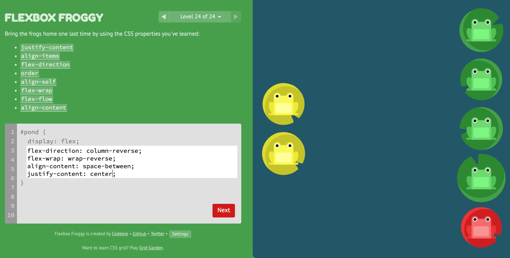

# Code 301 | Mustache and Flexbox

## Class 03 Reading Notes

### ["Javascript Templating Language and Engine: Mustache.js with Node and Express"]
(https://medium.com/@1sherlynn/javascript-templating-language-and-engine-mustache-js-with-node-and-express-f4c2530e73b2)

I. Templating

- "Javascript templating is a fast and efficient technique to render client-side view templates with Javascript by using a JSON data source."

- "The template is HTML markup, with added templating tags that will either insert variables or run programming logic."

- "The template engine then replaces variables and instances declared in a template file with actual values at runtime, and convert [sic] the template into an HTML file sent to the client."

II. Mustache

- A "logic-less" template syntax; logic-less because there are no if-statements, else-clauses, or loops, only tags.

- "It works by expanding tags in a template using values provided in a hash or object."

- Mustache syntax is two {{ ... }}, because it's a placeholder; it's name mustache because when turned on it's side, a curly brace looks a little like a mustache.

- Mustache is not a templating engine; rather, it is a "specification" for a templating language

III. Mustache.js

- An iteration of the mustache template in JS.

- Since mustache supports many languages, no need for a separate templating system on the back-end.

IV. Mustache-express

- Used to make Node or Express work with mustache.

### ["A Complete Guide to Flexbox"](https://css-tricks.com/snippets/css/a-guide-to-flexbox/)

I. CSS-tricks.com

  A. A general and useful reference to all things CSS.

  B. It's own layout and use of CSS is a testimony to its expertise.

II. CSkS-tricks on Flexbox

  A. It's page on flexbox is concise, well explained, and well illustrated.

  B. In my short time using flexbox, this page has been my primary source and has allowed me to pick up enough flexbox to use it as my primary tool for positioning elements on the page.

  C. Because the web page itself is the best reference for its concent, and it's linked in the title of this section, I'll end my notes on it here.

### ["Flexbox Froggy"](https://flexboxfroggy.com/)

I. Flexbox Froggy is a game that helps its players learn to use flexbox.

II. It is created by codepig.com, a company/team that helps users learn to code by playing games.

III. New flexbox properties I learned playing the game

  A. order: integer; repositions an item in a container vis-a-vis the other items, the default number of the item selected being 0.

  B. align-self: takes the same values as align-items, including center, flex-end, flex-start, etc.; it aligns only this item of those in the container.

  C. flex-flow

    1. Shorthand for flex-direction and flex-wrap, because these two properties are so often used together.

    2. It's value is that of each property separated by a space, e.g., row wrap

  D. align-content: while similar to align-items, this property is used to adjust the spacing among multiple lines (containers); it takes the same values as align-items, including stretch; with only one line, align-content will do nothing.

  E. It was both fun and effective!

[<--back](301week1.md)

[<--home-->](../../README.md)
