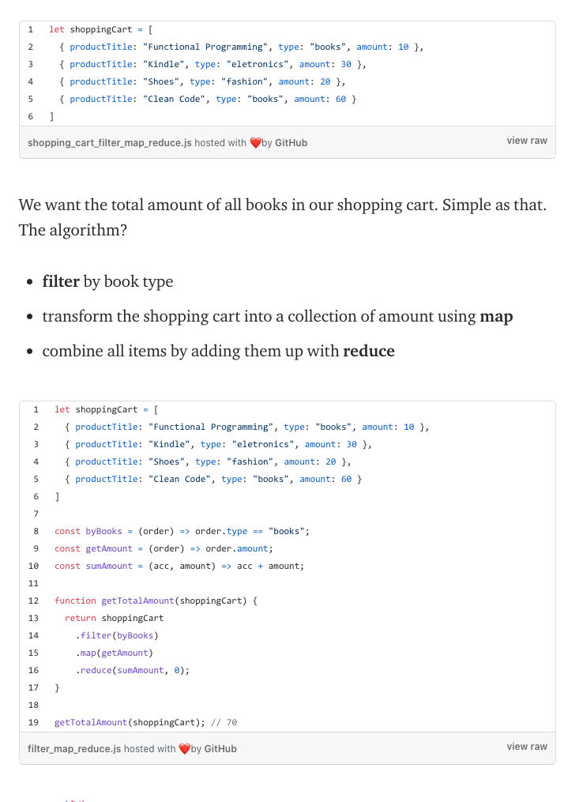

# Code 301 | Functional Programming

## Class 09 Reading Notes

### ["Concepts of Functional Programming in JavaScript"](https://medium.com/the-renaissance-developer/concepts-of-functional-programming-in-javascript-6bc84220d2aa)

I. Introduction

- “Complexity is anything that makes software hard to understand or to modify." — John Outerhout

- Funcational Programming = how to fix complexity. 

II. Functional Programming = a style of structuring computer programs "that treats computation as the evaluation of mathematical functions and avoids changing-state and mutable data" 

- Pure functions

  - return "the same result if given the same arguments" (aka deterministic);
  - do "not cause any observable side effects".
  - Impure functions include the following:
    - functions that read external files;
    - functions that depend on global variables (instead of having parameters);
    - functions that depend on a random-number generator;
    - functions that cause observable side effects, such as modifying a global variable or passing a parameter by reference;
    - functions that cause mutability.
  - "Pure functions are stable, consistent, and predictable. Given the same parameters, pure functions will always return the same result. We don’t need to think of situations when the same parameter has different results — because it will never happen."

- Benefit of pure functions

  - code that's easier to test
  - Immutability: "When data is immutable, its state cannot change after it’s created. If you want to change an immutable object, you can’t. Instead, you create a new object with the new value."
    - Avoid mutability in loops by writing recursive functions.

- Referential transparency = "if a function consistently yields the same result for the same input, it is referentially transparent."

- First-class functions = "The idea is to treat functions as values and pass functions like data."

- Higher-order functions takes functions as arguments and/or returns a function.

III. Filter, Map, and Reduce

- Allow for the use of declarative, instead of imperative, JavaScript.

- Filter: returns values that evalutate as true.
- Map: returns a new array of values that is the same length as the original array.
- Reduce: "receives a function and a collection, and returns a value created by combining the items."

### ["Fun with Refactoring: Refactoring JavaScript for Performance and Readability"](https://dev.to/healeycodes/refactoring-javascript-for-performance-and-readability-with-examples-1hec)

I. 

[<--back](301week1.md)

[<--home-->](../../README.md)
