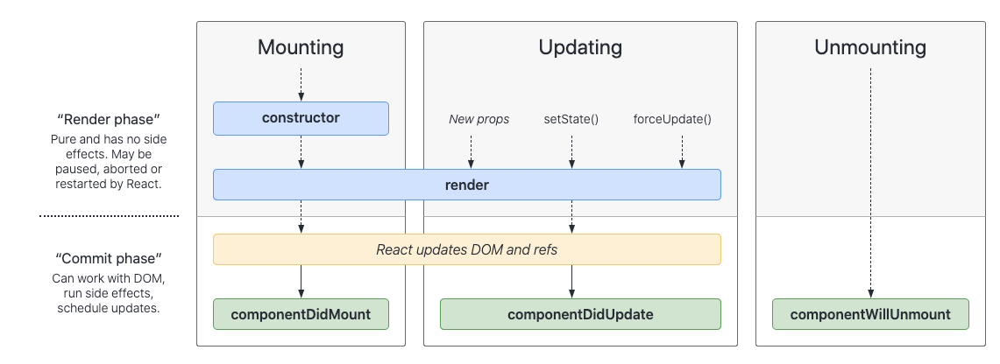

# Code 401 | Custom Hooks

## Class 32 Reading Notes

I. Research Questions

- What does a component’s lifecycle refer to?: mounting, updating, unmounting.

- Why do you sometimes need to “wrap” functions in useCallback when called from within useEffect: "useEffect() allows you to register a function which executes AFTER the current render cycle. . . . useCallback() often is used in conjunction with useEffect() because it allows you to prevent the re-creation of a function" ["ReactJS — useEffect() & useCallback()"](https://medium.com/@infinitypaul/reactjs-useeffect-usecallback-simplified-91e69fb0e7a3).

- Why are functional components preferred over class components?: easier syntax; less code; no "this"; hooks that replace and improve upon class components.

II. Vocabulary

- state hook: the hook in react that lets you access state (useState()) and set it (set{State}).
- effect hook: hooks that take effect after a point in a component's lifecycle, such as useEffect().
- reducer hook: returns the initially loaded version of a page, like resetting a calculator to zero (default).

III. Preview Reading Links

- ["Custom React Hooks"](https://www.telerik.com/kendo-react-ui/react-hooks-guide/#toc-custom-react-hooks)
- ["React Hooks with Async-Await"](https://dev.to/vinodchauhan7/react-hooks-with-async-await-1n9g)
- ["useReducer"](https://reactjs.org/docs/hooks-reference.html#usereducer)
- ["Building Your Own Hooks"](https://reactjs.org/docs/hooks-custom.html)
- ["useHooks.com"](https://usehooks.com/)
- ["Awesome React Hooks" GitHub Repo](https://github.com/rehooks/awesome-react-hooks)
- ["10 React Hooks you Should Have in Your Toolbox"](https://blog.bitsrc.io/10-react-custom-hooks-you-should-have-in-your-toolbox-aa27d3f5564d)

IV. Questions to Guide Reading

1. Which 3 things had you heard about previously and now have better clarity on?

- The component lifecycle.
- What exactly a hook is.
- 

2. Which 3 things are you hoping to learn more about in the upcoming lecture/demo?

- useEffect
- useReducer
- testing React apps

3. What are you most excited about trying to implement or see how it works?: useReducer

[<--back](401week7.md)

[<--home-->](../../README.md)
