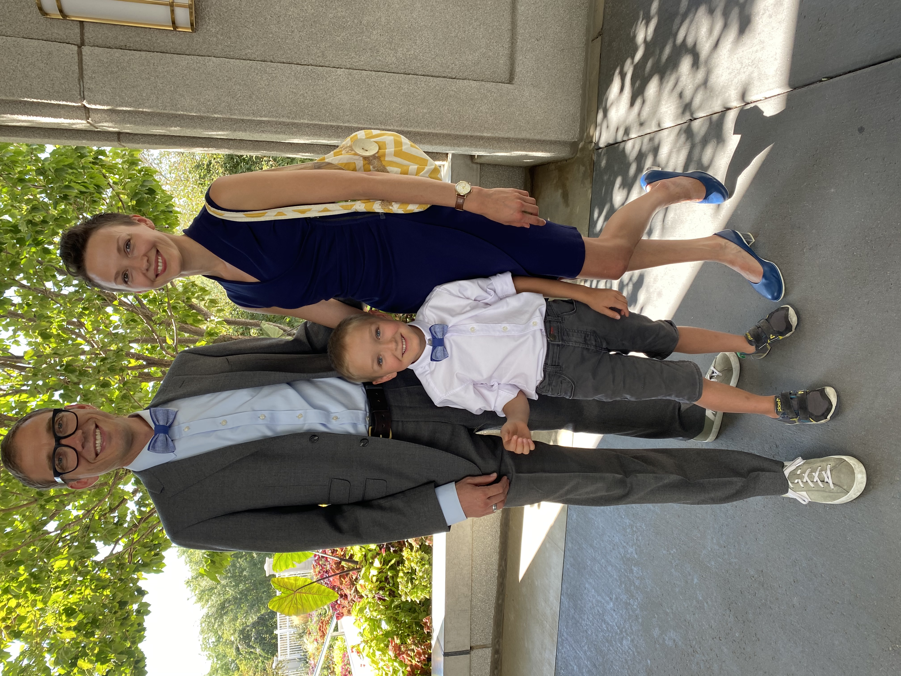

# Nathan Rhead Cox

## Table of Contents  

---
### Code 101

+ Day 1: [Mindset](Code-102/MINDSET.md) and [Markdown](Code-102/MARKDOWN.md) and [Text Editors](Code-102/TEXTEDITORS.md)
+ Day 2: [About Git](Code-102/ABOUTGIT.md) and [HTML](Code-102/HTML.md)
+ Day 3: [CSS](Code-102/CSS.md) and [Computer Architecture and Logic](Code-102/CompArchLogic.md)
+ Day 4: [Programming with JavaScript](Code-102/Program_withJS.md) and [Operators and Loops](Code-102/OperatorsLoops.md)

---

### Code 201

+ [Week 1](Code-201/201week1.md)
+ [Week 2](Code-201/201week2.md)
+ [Week 3](Code-201/201week3.md)
+ [Week 4](Code-201/201week4.md)

---

## About Me

A twin and the youngest of fifteen children, Nathan currently finds himself in the relative quiet of a small family in a small town. Nathan is fluent in Russian and is keen on adding coding to that short list of foreign languages.

---
> My profiles on [GitHub](https://github.com/nathanrhead){:target="_blank" rel="noopener"} and [LinkedIn](https://www.linkedin.com/in/nathanrheadcox/){:target="_blank" rel="noopener"}
---

