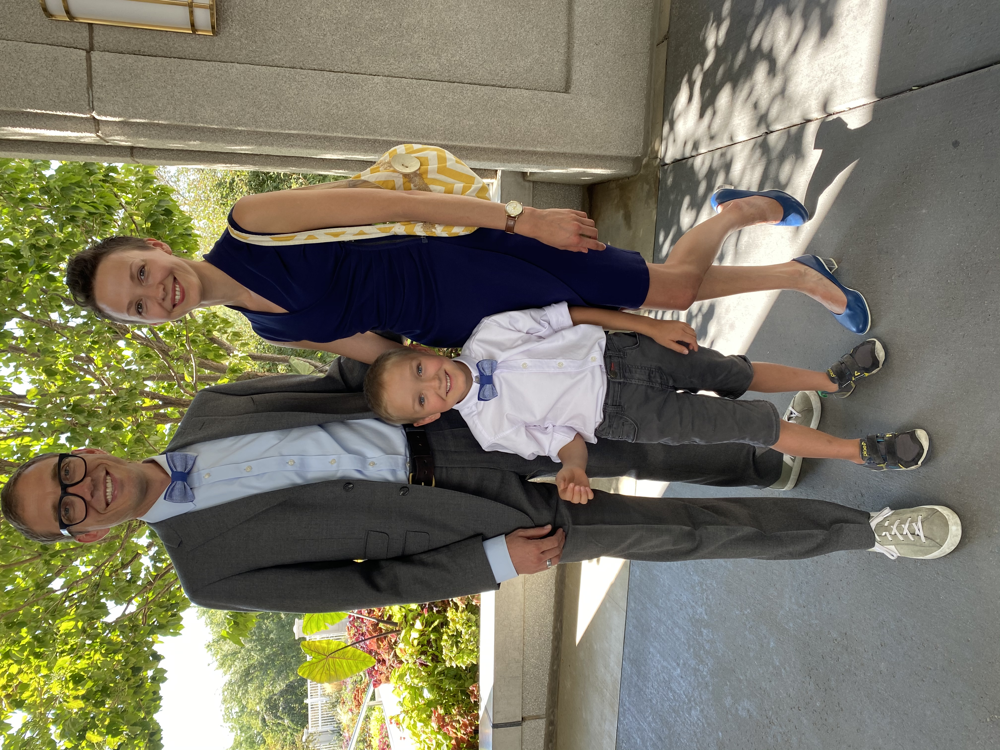

# Table of Contents  
---
+ Day 1: [Mindset](MINDSET.md) and [Markdown](MARKDOWN.md)
+ Day 2:
+ Day 3:
+ Day 4:
+ Day 5: 
---
## About Me
#### > A twin and the youngest of fifteen children, Nathan currently finds himself in the relative quiet of a small family in a small town. Nathan is fluent in Russian and is keen on adding coding to that short list of foreign languages.
---
> My profiles on [GitHub](https://github.com/nathanrhead){:target="_blank" rel="noopener"} and [LinkedIn](www.linkedin.com/in/nathanrheadcox){:target="_blank" rel="noopener"}
---

